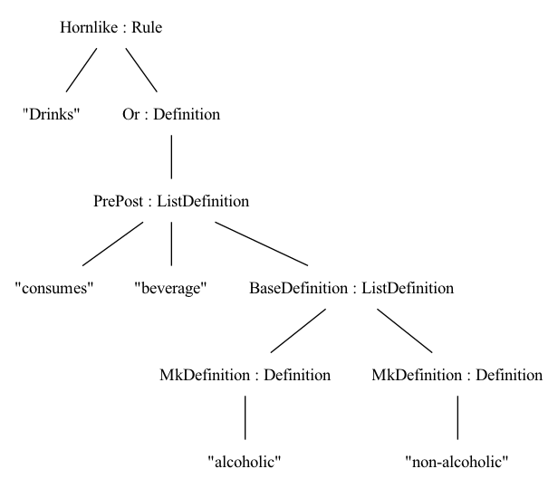

# GF grammar

This is a quick demo, probably not worth pursuing for production. Just to experiment on things without the baggage of the old codebase.

## Example use

```
$ gf L4cnc.gf
linking ... OK

Languages: L4cnc

L4> l Hornlike "Drinks" (Or (PrePost "consumes" "beverage" (BaseDefinition (MkDefinition "alcoholic") (MkDefinition "non-alcoholic"))))
```
Generates the following HTML:

<table> <tr> <th> Drinks </th> <td> MEANS </td>  <td></td> </tr> <tr> <td> consumes </td> <td></td> <td> alcoholic </td> </tr> <tr> <td></td> <td> OR </td> <td> non-alcoholic </td> </tr> <tr> <td> beverage </td> <td></td> <td></td> </tr> </table>

View it as a tree with the following command:
```
L4> vt -view=open Hornlike "Drinks" (Or (PrePost "consumes" "beverage" (BaseDefinition (MkDefinition "alcoholic") (MkDefinition "non-alcoholic"))))
```




### Generating all trees

```
-- To generate all trees up to depth 5
L4> gt -depth=5 | l | wf
L4> ! mv _gftmp result.html
L4> ! open result.html
```

Note that the table width is buggy, hope you get the idea anyway. This is really just a very rough prototype to given an idea how a more abstract AST could look like. (But of course, it's not nice to parse this with all the HTML tags.)