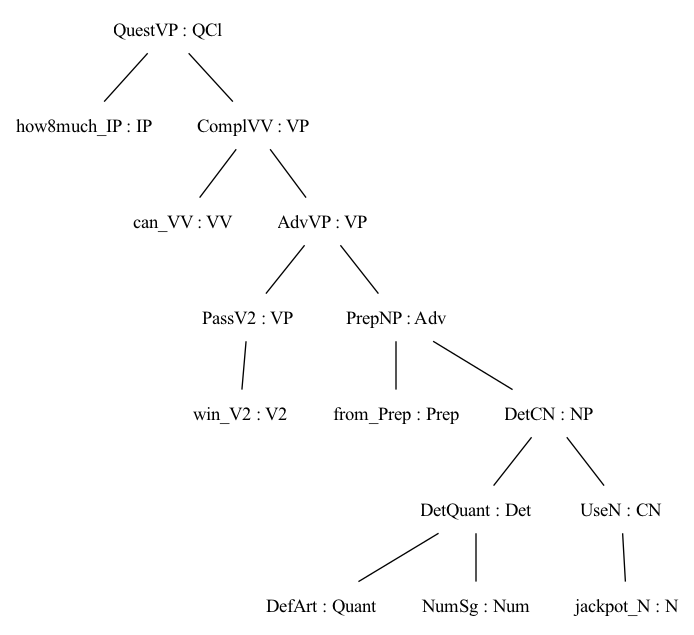

# GF grammar

WIP toy grammar. So far not connected to any version of Lam4 AST (neither Langium nor Haskell version). Idea is to just have a quick demo to show how the pipeline works.


## Test grammar in GF shell

```
$ gf Lam4Eng.gf
linking ... OK

Languages: Lam4Eng
Lam4> l -unlextext MetadataRecordDecl "Lottery" "a type of game" (ConsTypeAnnot (MetadataTypeAnnot "how much can be won from the jackpot" (MkTypeAnnot "‘total jackpot’" "Integer")) (ConsTypeAnnot (MetadataTypeAnnot "whether buying tickets from this lottery is tax deductible" (MkTypeAnnot "‘tax deductible status’"  "Boolean")) BaseTypeAnnot)) | ? tr "°∞" " \n"
```
should linearize into the following
```
A Lottery is a type of game. Each Lottery has associated with it information like
   * its ‘total jackpot’; i.e. how much can be won from the jackpot
   * its ‘tax deductible status’; i.e. whether buying tickets from this lottery is tax deductible
```

## Syntax trees

Here's the same GF tree in a more readable format.

```haskell
MetadataRecordDecl "Lottery" "a type of game"
    ( ConsTypeAnnot
        ( MetadataTypeAnnot "how much can be won from the jackpot"
            ( MkTypeAnnot "‘total jackpot’" "Integer" )
        )
        ( ConsTypeAnnot
            ( MetadataTypeAnnot "whether buying tickets from this lottery is tax deductible"
                ( MkTypeAnnot "‘tax deductible status’" "Boolean" )
            ) BaseTypeAnnot
        )
    )
```

RecordDecl isn't supported yet as of 28 Aug, but suppose that it is, then the process is as follows:

1. A Haskell datatype is automatically generated from the GF grammar (standard feature of GF)
2. Transform a tree of either source (Langium JSON or Haskell AST) into the Haskell version of the GF grammar. (We write a general transformation function—obviously not doing this manually for every single tree.)
3. Linearize the tree in GF.

If the rendering is simple enough to just use plain strings, as is the case in the toy grammar, I'm happy to use any other tool. GF is probably overkill for just swapping the order of some fixed strings.

But if we want to parse the strings into actual syntax trees, then GF makes sense.

```
> p "how much can be won from the jackpot"
```




And with that we can do all kinds of NLG, way beyond the purely string-based approach.